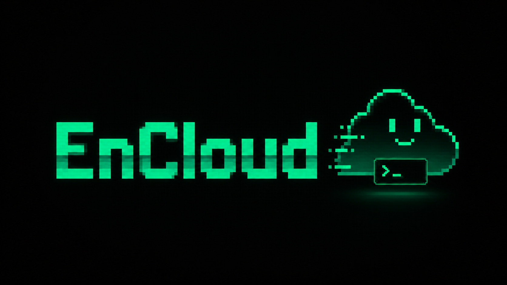

<p align="center">
  
</p>

<p align="center">
  <strong>A keyboard-first control surface for deliberate Engram Cloud synchronization.</strong><br>
  Select known projects, review local sync snapshots, and run Status, Pull, or Push through the installed <code>engram</code> CLI.
</p>

<p align="center">
  <a href="#quick-start">Quick Start</a> &bull;
  <a href="#how-it-works">How It Works</a> &bull;
  <a href="#usage">Usage</a> &bull;
  <a href="#configuration-and-security">Configuration</a> &bull;
  <a href="#development">Development</a> &bull;
  <a href="#distribution-status">Distribution</a>
</p>

---

EnCloud TUI is a local [Bubble Tea](https://github.com/charmbracelet/bubbletea) application for developers who already use [Engram](https://github.com/Gentleman-Programming/engram) and want an explicit workflow for a small set of configured Cloud projects.

EnCloud TUI owns the terminal interface, secure local persistence, process orchestration, cancellation, output redaction, and time-stamped sync snapshots. The installed `engram` CLI performs Cloud operations, and Engram Cloud remains authoritative for remote state.

## Quick Start

### Requirements

- Linux or macOS.
- Go 1.25 or newer.
- The official `engram` executable installed separately and available on `PATH`.
- An HTTPS Engram Cloud server, a valid public Cloud token, and one or more known project IDs.

Confirm that the required CLI is available:

```bash
engram version
engram cloud --help
engram sync --help
```

EnCloud TUI does not bundle, install, or replace Engram. Use the [official Engram repository](https://github.com/Gentleman-Programming/engram) for its current installation instructions.

### Install From Source

Source installation is the only documented installation path. From a checkout of this repository:

```bash
make build
./encloud-tui
```

The first launch opens the configuration wizard. Enter the server URL, Cloud token, and comma-separated project IDs. Use `make run` instead for an iterative development session.

> **No EnCloud TUI release or Homebrew package is published.** The public repository does not currently provide release archives, a tap, or a formula. Do not use guessed download URLs or `brew` commands.

## How It Works

```text
Keyboard input
      |
      v
Bubble Tea UI -----> local config + last-known snapshots
      |
      v
installed engram CLI -----> Engram Cloud
```

For each confirmed batch, EnCloud TUI configures the server once, then processes selected projects sequentially. Enrollment is best-effort: an enrollment failure is reported, but the requested sync command still runs. A sync command failure ends the batch and leaves later projects skipped.

Operations run asynchronously with respect to the UI, while child commands remain sequential. `Esc` requests cancellation; the interface waits for the child process and runner to emit their terminal result before considering the operation finished. Recent logs are bounded and the configured token is redacted.

The exact delegated commands are:

```text
engram cloud config --server SERVER
engram cloud enroll PROJECT
engram sync --cloud --status --project PROJECT
engram sync --cloud --import --project PROJECT
engram sync --cloud --project PROJECT
```

See [Architecture](docs/architecture.md) for ownership boundaries, event flow, snapshot classification, UI invariants, and non-goals.

## Usage

1. Complete the first-run wizard.
2. Open **Sync center** from Home.
3. Select one or more projects with `Space`.
4. Press `s` for Status, `p` for Pull, or `u` for Push.
5. Review the confirmation screen and confirm with `Enter` or `y`.
6. Follow the redacted output and final per-project result.

Status, Pull, and Push require at least one selected project and always require confirmation.

### Main Shortcuts

| Key | Action |
| --- | --- |
| `Up` / `Down`, `k` / `j` | Move between projects or menu items. |
| `Space` | Select or clear the focused project. |
| `s` | Check Status for selected projects. |
| `p` | Pull selected projects. |
| `u` | Push selected projects. |
| `a` | Add a project. |
| `c` | Edit configuration. |
| `Enter` / `y` | Confirm a queued operation. |
| `Esc` / `n` | Cancel confirmation; `Esc` also goes back or requests cancellation while running. |
| `q` / `Ctrl+C` | Quit when idle; request cancellation and quit after the terminal event while running. |

### Read Snapshots Correctly

> **Snapshots are local state derived from earlier CLI output, not live Cloud truth. Run Status to refresh the evidence whenever current remote state matters.**

| Displayed value | Meaning |
| --- | --- |
| `Unknown` / `Never` | No compatible local observation is saved. |
| Synced, Pull required, Push required, or Diverged | The last recognized Status output saved locally. |
| Synced after Pull or Push | That operation completed successfully; it is still a local observation. |
| Error | The operation failed and final project output was available. |

A cancelled batch or unrecognized Status output leaves the previous snapshot unchanged. The snapshots are not a Cloud cache, operation history, or audit log.

The interface adapts to terminal width: panels and inputs shrink, long values are wrapped or ellipsized, and shortcut hints stack. Focus, selection, primary actions, and explicit status text remain available without relying on color alone.

## Configuration And Security

| Setting | Purpose |
| --- | --- |
| Server URL | HTTPS Engram Cloud endpoint passed to the CLI. |
| Cloud token | Forwarded only to child processes as `ENGRAM_CLOUD_TOKEN`. |
| Project IDs | Local set of projects shown in Sync Center. |

The default configuration is `~/.config/encloud-tui/config.json`. Set `ENCLOUD_TUI_CONFIG` to select another file. Configuration and state are local, permission-restricted JSON files; the token is masked in the UI, excluded from command arguments, isolated from inherited Engram token variables, and redacted from recent output.

Read [Configuration and security](docs/configuration.md) for validation rules, exact default, custom, and legacy paths, state binding, atomic persistence, runtime isolation, trust boundaries, and recovery behavior.

## Development

Use the Makefile as the repository-level development interface:

```bash
make fmt    # Format Go packages
make vet    # Run static analysis
make test   # Run the test suite
make build  # Build ./encloud-tui
make run    # Run from source
```

Start with [Architecture](docs/architecture.md) to identify the package that owns a behavior. Keep changes and focused tests together, then run the applicable repository-level checks. Test coverage includes configuration validation, secure persistence and failure paths, path selection, CLI plans and cancellation, UI navigation and selection, snapshots, and narrow-width rendering.

Update documentation when a change alters configuration, CLI invocation, snapshot semantics, security boundaries, shortcuts, accessibility behavior, or distribution status.

## Distribution Status

The repository contains automation intended to build Linux and macOS archives for `amd64` and `arm64`, with checksums and SBOMs, when a maintainer publishes a version tag. Configuration is not evidence that an artifact exists.

There is currently no published EnCloud TUI version, GitHub Release archive, Homebrew tap, or formula. Build from source until this README names a real published artifact and its exact installation path. The `engram` CLI will remain a separate dependency.

## License

EnCloud TUI is available under the [MIT License](LICENSE).
